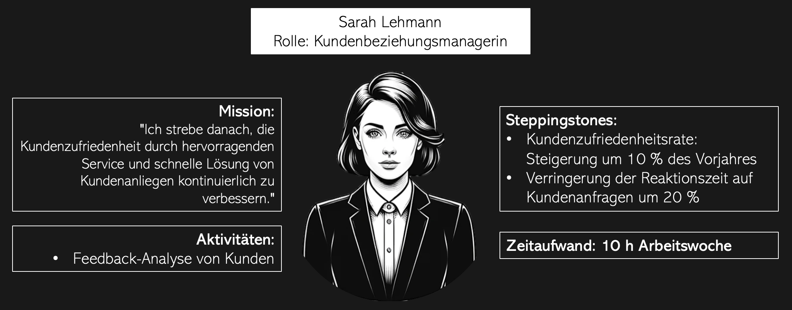

## Das Selbstmanagement-Modell
**Die Vision einer zukunftsfähigen Organisation**

**Eine Präsentation von Leonie Weimann**

---

## Gliederung

1. Das neue Arbeitsmodell
2. Relevanz für Ihre Organisation
3. Implementierung des Modells
4. Schlüsselstrategien für den Erfolg
5. Mehrwert für Ihre Kunden
6. Abschluss

---
## 1. Das neue Arbeitsmodell

- Entwicklung in den 1990er Jahren
- Anwendung bei Morning Star, einem Tomaten-Truck Betrieb in Kalifornien
- Grundprinzipien
  - keine traditionellen Manager oder Hierarchien
  - "CLOU" (College Letter of Understanding) als zentrales Element 
    - dient als Betriebsplan
    - fördert die dynamische Zusammenarbeit
---
## 1. Das neue Arbeitsmodell

**Vorteile des Modells**
- Autonomie und Verantwortung
- Flexibilität
- Effizienz
- Mitarbeiterzufriedenheit

---
## 2. Relevanz für Ihre Organisation

**Aktuelle Herausforderungen großer Organisationen**
- langsame Reaktionen auf Marktveränderungen und Innovationen
- Kommunikationsbarrieren und Informationsverluste 
- Silodenken: isolierte Arbeitsweise, Wissensaustausch fehlt
- Rückstand deutscher Unternehmen beim Thema Agilität

---
## 2. Relevanz für Ihre Organisation

**Wie adressiert das Selbstmanagement diese Herausforderungen?**
- Förderung von Eigenverantwortung
- Proaktive Kommunikation
- Umfeld des Vertrauens
- Anerkennung der Fachkompetenz

---
## 3. Implementierung des Modells

**Wie kann das Modell in Ihre Organisation implementiert werden?**

---
*3. Implementierung des Modells*
### Individualität von Unternehmen

- Bedarf individueller Anpassung
- Respekt für bisherige Strukturen
- Aufbauend auf das Bestehende
- Empfehlung: Schrittweise Implementierung

---
*3. Implementierung des Modells*

---
*3. Implementierung des Modells*
### Pilotprojekte 

- Pilotprojekte: Erster Schritt zur Implementierung
  - Test in kontrolliertem, kleinen Umfeld
  - Auswahl repräsentativer Abteilungen (technisch, administrativ, kundenorientiert)

---
*3. Implementierung des Modells*
### Führungsunterstützung

- Management-Unterstützung ist entscheidend
- Schulungen und Meetings mit Agilem Team
- Information über Forschritte und Bereitstellung von Tools
- Belohnungssystem einführen bei Mangel an Beteiligung

---
*3. Implementierung des Modells*
### Rollenanpassung

- Rollen basierend auf Fähigkeiten, nicht Titeln
- Feedback-Gespräche und Peer-Reviews zur Evaluation
- Persönliche Aufgabenbeschreibung in CLOUS
- spezifische Rollenbeschreibungen

---
*3. Implementierung des Modells*
### Merkmale von CLOUS
- software-basierte CLOUS
  - Mission, Aktivitäten, Steppingstones, Zeitaufwand

---
*3. Implementierung des Modells*
### Merkmale von CLOUS
- schnelle Überarbeitungsmöglichkeiten
- integriertes Kollegen-Bewertungssystem
- Fokus auf Kommunikation und Transparenz
- Schulung zur Nutzung von CLOUS

---
*3. Implementierung des Modells*
### Entscheidung zur Implementierung
**Hybrid- vs. Vollimplementierung**

Entscheidung basierend auf Pilotprojekt-Erfahrungen

---
*3. Implementierung des Modells*
### Kontinuierliche Verbesserung
**Stetige Anpassung und Bewertung**
- Anpassung an ändernde Unternehmensbedürfnisse
- Regelmäßige Bewertung für Effektivität und gewünschte Ergebnisse

---
## 4. Schlüsselstragien für den Erfolg

---
*4. Schlüsselstragien für den Erfolg*
### Überwindung von Widerständen

- Unvermeidlicher Widerstand gegen Veränderungen
- Wichtigkeit der Kommunikation von Vorteilen
- Klarstellung der Rollen
- Stufenweise Implementierung

---
*4. Schlüsselstrategien für den Erfolg*
### Förderung der Eigeninitative

- Verantwortungsübernahme fördern
- Vorschläge von Kollegen evaluieren lassen

---
*4. Schlüsselstrategien für den Erfolg*
### Schulungen und Weiterbildung

- umfassende Schulungen vor Implementierung
- Unsicherheiten abbauen
- Vermittlung notwendiger Fähigkeiten

---
*4. Schlüsselstrategien für den Erfolg*
### Feedback und Anpassung

- System regelmäßig überprüfen
- Feedback der Mitarbeiter ist essentiell
- regelmäßiges Feedback der CLOU-Kollegen
- jährliche Strategietreffen der Teams

---
*4. Schlüsselstrategien für den Erfolg*
### Konfliktmanagement

- Prozess zur Konfliktlösung

- Betonung der Mutigkeit in Schulungen

---
*4. Schlüsselstrategien für den Erfolg*
### Bottom-Up Ansatz

- Mitarbeiter aktiv involvieren
- Transparenz und Zugriff auf wichtige Daten
- verhindert Informationsbarrieren

---
*4. Schlüsselstrategien für den Erfolg*
### Vergütungs- und Belohnungssystem

- Fachkenntnisbasierte Vergütung
- Jährliche Selbstbewertung
- Vergütungsausschüsse

---
*4. Schlüsselstrategien für den Erfolg*
### Rekrutierungsmaßnahmen

- **Anpassung an Gen Y und Z**
  - Digitale Bewerbungsprozesse
  - Weiterentwicklung 
  - Work Life Balance
- **Umsetzung**
  - Online-Bewerbungsformulare
  - Video-Interviews
  - Informative Materialien, Videos, Webinare auf der Webseite

---
## 5. Mehrwert für Ihre Kunden

- schnelle Entscheidungsfindung
  - direkte Reaktion auf Kundenfeedback
  - schnelle Problemlösung
- Flexibilität
  - individuelle Kundenbedüfnisse
  - Kreativität und Innovation
- Mitarbeiterzufriedenheit
  - tiefgehendes Verständnis der Kunden

---
## 6. Abschluss

**Rückblick auf die Vision**
- Organisation mit wertgeschätzten Mitarbeitern
- Treiber von Innovationen
- positive Energie intern und extern sichtbar

---
## 6. Abschluss

**Erfolge**
- nicht jeder Mitarbeiter ist für das Modell geeignet
- Respekt für individuelle Entscheidungen
- Wichtigkeit von Testphasen zur Ermittlung des Modells

---
## Referenzen

- Hamel, G. (2021): First, let's fire all the managers. In: Harvard Business Review, 12, 2011)
- Schumacher, T.; Wimmer, R. (2019): Der Trend zur hierarchiearmen Organisation. In: OrganisationsEntwicklung, 02, 2019, S. 12-18.
- Schumacher, T.; Wimmer, R. (2019): Komplexität durch Schlichtheit managen. In: OrganisationsEntwicklung, 02, 2019, S. 51-55.
---
## Referenzen

- Wartzmann, R. (2012): If selfmanagement is such a great ide, why aren't more companies doing it?, url: https://www.forbes.com/sites/drucker/2012/09/25/self-management-a-great-idea/?sh=75dfc10011de; Abfrage 05.11.2023.
